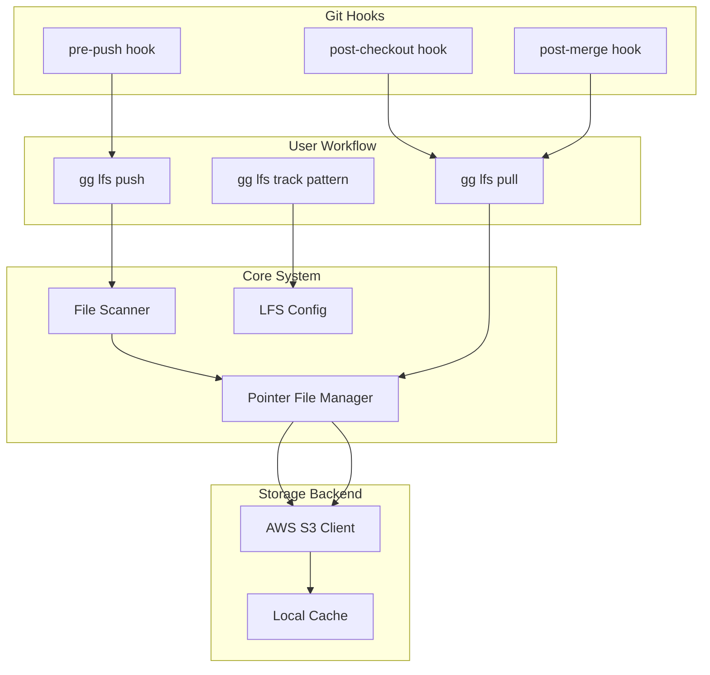

# gg lfs - Custom Large File Storage

## Overview

Implement an LFS alternative that stores large files in AWS S3, using git-lfs compatible pointer files and .gitattributes patterns. The system will support both manual commands and automatic git hooks.

## Architecture




## File Structure

```
src/
├── commands/
│   └── lfs/
│       ├── mod.rs          # LFS subcommand dispatcher
│       ├── track.rs        # gg lfs track
│       ├── push.rs         # gg lfs push  
│       ├── pull.rs         # gg lfs pull
│       ├── status.rs       # gg lfs status
│       ├── install.rs      # gg lfs install (hooks)
│       └── uninstall.rs    # gg lfs uninstall
├── lfs/
│   ├── mod.rs              # LFS core module
│   ├── pointer.rs          # Pointer file parsing/creation
│   ├── scanner.rs          # .gitattributes pattern matching
│   ├── storage/
│   │   ├── mod.rs          # Storage trait
│   │   └── s3.rs           # AWS S3 implementation
│   └── cache.rs            # Local file cache (~/.cache/gg-lfs/)
└── main.rs                 # Add lfs subcommand
```

## Configuration

### 1. Storage credentials (`.gg/lfs.toml` in repo root)

```toml
[storage]
provider = "s3"
bucket = "my-company-lfs"
region = "us-east-1"
prefix = "project-name/"  # optional path prefix

# Credentials via env vars: AWS_ACCESS_KEY_ID, AWS_SECRET_ACCESS_KEY
# Or use AWS profiles/IAM roles
```

### 2. File patterns (`.gitattributes` - LFS compatible)

```
*.psd filter=lfs diff=lfs merge=lfs -text
*.zip filter=lfs diff=lfs merge=lfs -text
assets/models/** filter=lfs diff=lfs merge=lfs -text
```

## Pointer File Format (LFS Compatible)

```
version https://git-lfs.github.com/spec/v1
oid sha256:4d7a214614ab2935c943f9e0ff69d22eadbb8f32b1258daaa5e2ca24d17e2393
size 12345
```

- Must be under 1024 bytes
- Keys sorted alphabetically (except version first)
- SHA-256 hash of file content
- Compatible with git-lfs for migration

## Commands

### `gg lfs install`

- Install git hooks (pre-push, post-checkout, post-merge)
- Create `.gg/lfs.toml` template if missing
- Add `.gg/` to `.gitignore` if needed

### `gg lfs track <pattern>`

- Add pattern to `.gitattributes` with `filter=lfs diff=lfs merge=lfs -text`
- Stage the `.gitattributes` change

### `gg lfs untrack <pattern>`

- Remove pattern from `.gitattributes`

### `gg lfs push`

- Scan staged/committed files matching LFS patterns
- Upload any files not yet in remote storage
- Replace local files with pointer files
- Flags: `--dry-run`, `--all` (push all LFS files, not just staged)

### `gg lfs pull`

- Scan working directory for pointer files
- Download actual files from S3
- Replace pointers with real files
- Flags: `--include=<pattern>`, `--exclude=<pattern>`

### `gg lfs status`

- Show which files are tracked by LFS
- Show which pointers are missing actual files
- Show upload/download status

### `gg lfs migrate`

- Convert existing large files to pointers
- Flags: `--import` (from git-lfs), `--export` (to git-lfs)

## Dependencies to Add

```toml
[dependencies]
aws-sdk-s3 = "1"
aws-config = "1"
tokio = { version = "1", features = ["rt-multi-thread", "macros"] }
sha2 = "0.10"           # SHA-256 hashing
glob = "0.3"            # Pattern matching
toml = "0.8"            # Config parsing
serde = { version = "1", features = ["derive"] }
dirs = "5"              # For cache directory (~/.cache/gg-lfs)
```

## Git Hooks

### pre-push (`.git/hooks/pre-push`)

```bash
#!/bin/sh
exec gg lfs push
```

### post-checkout (`.git/hooks/post-checkout`)

```bash
#!/bin/sh
exec gg lfs pull
```

### post-merge (`.git/hooks/post-merge`)

```bash
#!/bin/sh
exec gg lfs pull
```

## Local Cache

Location: `~/.cache/gg-lfs/<sha256-prefix>/<sha256>`

- Cache downloaded files to avoid re-downloading
- Shared across repositories
- `gg lfs prune` command to clean old cached files

## Error Handling

- Missing credentials: Clear error with setup instructions
- Network failures: Retry with exponential backoff
- Partial uploads: Track progress, resume on retry
- Conflicts: Pointer files should merge cleanly (they're just text)

## Migration Path from git-lfs

1. Existing pointer files are compatible (same format)
2. `gg lfs migrate --import` can re-upload from LFS server to S3
3. Team members can switch gradually (both systems read same pointers)
