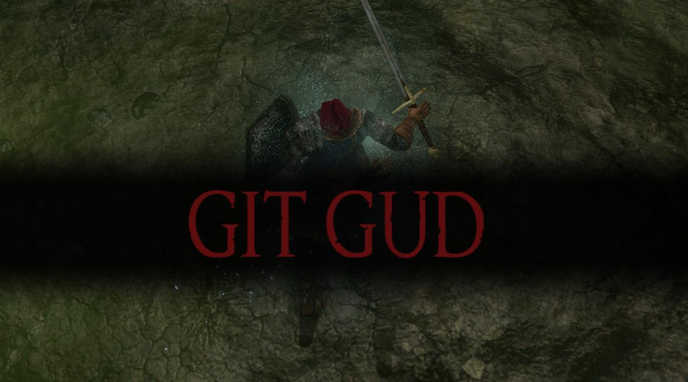

# Git Gud

A smarter git CLI wrapper with sensible defaults. Any command not implemented falls back to git with full color and interactivity preserved.

## Install

- [Install git](https://git-scm.com/downloads)
- [Install rust and cargo](https://doc.rust-lang.org/cargo/getting-started/installation.html)
- Run `cargo install git-gud`

## Commands

### `gg status` (alias: `s`)

Custom status view with grouped changes.

| Flag | Description |
|------|-------------|
| `-s, --short` | Show short format (delegates to `git status -s`) |

### `gg push` (alias: `p`)

Smart push with auto-upstream for branches.

- On main/master: runs `git push`
- On a branch: runs `git push --set-upstream origin <branch>` if no upstream is set

| Flag | Description |
|------|-------------|
| `-f, --force` | Force push with `--force-with-lease` |

### `gg sync`

Sync your branch with main/master.

- On main/master: runs `git pull --rebase`
- On a branch: stashes changes, checks out main, pulls, checks out your branch, rebases on main, pops stash

| Flag | Description |
|------|-------------|
| `--no-stash` | Don't stash changes before syncing |

### `gg quick-commit <message>` (alias: `qc`)

Stage and commit in one step.

| Flag | Description |
|------|-------------|
| `-A, --all` | Stage all changes including untracked files (`git add -A`) |
| `-p, --push` | Push after committing |

**Examples:**
```bash
gg qc "fix typo"              # Commit tracked changes only
gg qc "add feature" -A        # Commit everything including new files
gg qc "ready for review" -Ap  # Commit all and push
```

### `gg amend`

Amend the last commit.

| Flag | Description |
|------|-------------|
| `-a, --all` | Stage all changes before amending |
| `-e, --edit` | Edit the commit message (default: keep existing message) |

### `gg undo [count]`

Undo the last commit(s), keeping changes staged.

| Argument/Flag | Description |
|---------------|-------------|
| `count` | Number of commits to undo (default: 1) |
| `--hard` | Discard changes entirely (hard reset) |

**Examples:**
```bash
gg undo           # Undo last commit, keep changes staged
gg undo 3         # Undo last 3 commits
gg undo --hard    # Undo and discard changes
```

### `gg pr`

Open PR/MR creation page in browser. Supports GitHub, GitLab, and Bitbucket.

| Flag | Description |
|------|-------------|
| `-p, --print` | Just print the URL, don't open browser |

### `gg clean-branches`

Delete local branches that have been merged into main/master.

| Flag | Description |
|------|-------------|
| `-f, --force` | Actually delete branches (dry-run by default) |

### `gg recent`

List recently checked out branches.

| Flag | Description |
|------|-------------|
| `-c, --count <N>` | Number of branches to show (default: 10) |

### `gg sw [number]`

Switch to a recent branch. Interactive if no number provided.

| Argument | Description |
|----------|-------------|
| `number` | Branch number from `gg recent` to switch to |

**Examples:**
```bash
gg sw      # Interactive: shows list and prompts
gg sw 2    # Switch to 2nd most recent branch
```

### `gg today`

Show commits made today.

| Flag | Description |
|------|-------------|
| `-a, --all` | Show all authors, not just yours |

### `gg standup`

Show commits since last workday (for standup meetings).

| Flag | Description |
|------|-------------|
| `-a, --all` | Show all authors, not just yours |
| `-d, --days <N>` | Look back N days instead of auto-detecting |

### `gg lfs`

Large File Storage - store large files in AWS S3 instead of git.

**Subcommands:**

| Subcommand | Description |
|------------|-------------|
| `install` | Install git hooks for automatic LFS push/pull |
| `uninstall` | Remove LFS git hooks |
| `track <pattern>` | Track files matching pattern with LFS (e.g., `*.psd`) |
| `untrack <pattern>` | Stop tracking a pattern |
| `push` | Upload LFS files to remote storage |
| `pull` | Download LFS files from remote storage |
| `status` | Show LFS configuration, patterns, and file status |
| `verify` | Test S3 configuration and connectivity |

**Setup:**
```bash
gg lfs install                  # Install hooks and create config
# Edit .gg/lfs.toml with your S3 bucket details
gg lfs track "*.psd"            # Track Photoshop files
gg lfs track "assets/**"        # Track entire directory
```

**Configuration (.gg/lfs.toml):**
```toml
[storage]
provider = "s3"
bucket = "my-lfs-bucket"
region = "us-east-1"
# prefix = "project-name/"      # Optional prefix
# endpoint = "https://..."      # For S3-compatible services

[storage.credentials]
access_key_id = "AKIA..."
secret_access_key = "..."
```

**AWS Setup:**

1. **Create an S3 bucket** — Go to S3 in the AWS Console, create a bucket with a unique name (e.g. `my-project-lfs`), pick a region, and leave all other settings as defaults (block public access = on).

2. **Create an IAM user** — Go to IAM → Users → Create user. Name it something like `gg-lfs`.

3. **Create and attach a policy** — Create a custom policy with this JSON and attach it to the user:
   ```json
   {
     "Version": "2012-10-17",
     "Statement": [
       {
         "Effect": "Allow",
         "Action": [
           "s3:ListBucket",
           "s3:GetObject",
           "s3:PutObject",
           "s3:DeleteObject"
         ],
         "Resource": [
           "arn:aws:s3:::my-project-lfs",
           "arn:aws:s3:::my-project-lfs/*"
         ]
       }
     ]
   }
   ```
   Replace `my-project-lfs` with your actual bucket name.

4. **Create access keys** — Go to the user → Security credentials → Create access key → Choose "Command Line Interface". Save the Access Key ID and Secret Access Key.

5. **Configure gg lfs** — Run `gg lfs install`, then edit `.gg/lfs.toml` with your bucket name, region, and credentials. Verify with `gg lfs verify --write`.

**Push/Pull flags:**

| Flag | Description |
|------|-------------|
| `-n, --dry-run` | Show what would be uploaded/downloaded |
| `-a, --all` | Push all LFS files, not just staged (push only) |
| `-i, --include <pattern>` | Include only matching files (pull only) |
| `-e, --exclude <pattern>` | Exclude matching files (pull only) |

**Status flags:**

| Flag | Description |
|------|-------------|
| `-v, --verbose` | Show detailed file information |

**Verify flags:**

| Flag | Description |
|------|-------------|
| `-w, --write` | Also test write permissions by uploading a small test file |

### Git Fallback

Any unrecognized command passes through to git with full colors preserved:

```bash
gg log --oneline -10    # → git log --oneline -10
gg checkout -b feature  # → git checkout -b feature
gg stash pop            # → git stash pop
```



## License

MIT

